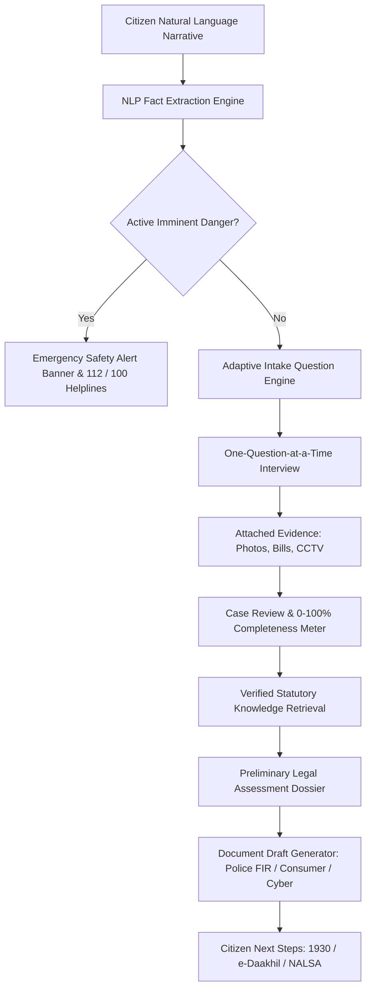

# LawBot AI — Legal Information & Case Assistant

> **"Understand your legal issue. Organize your case. Know your next step."**

[](https://fastapi.tiangolo.com)
[](https://react.dev)
[](https://www.typescriptlang.org/)
[](https://tailwindcss.com)
[](https://python.org)
[](#)

---

## 1. Product Vision & Principles

**LawBot AI** is an accessible, citizen-centric, mobile-first legal assistance platform engineered for ordinary citizens in India who have no background in legal terminology.

### Core Mission
1. **Plain-Language Intake**: Explain what happened without knowing section numbers or legal jargon.
2. **Deterministic Fact Extraction**: Understands everyday citizen narratives (e.g., *"My phone was stolen yesterday from my room"*) and extracts incident type, objects, timestamps, locations, and monetary amounts.
3. **Adaptive One-Question-at-a-Time Engine**: Avoids repeating known facts; asks short, high-value questions with large accessible buttons.
4. **Digital Evidence Management**: Securely attaches photos, receipts, CCTV footage, and bank statements linked directly to case facts under **Section 63 of Bharatiya Sakshya Adhiniyam, 2023**.
5. **Zero-Hallucination Legal Knowledge Engine**: Matches facts strictly against verified statutory provisions across:
   - **Bharatiya Nyaya Sanhita, 2023 (BNS)**
   - **Bharatiya Nagarik Suraksha Sanhita, 2023 (BNSS)**
   - **Bharatiya Sakshya Adhiniyam, 2023 (BSA)**
   - **Information Technology Act, 2000 (IT Act)**
   - **Consumer Protection Act, 2019 (CPA)**
6. **Actionable Complaint Drafts**: Generates formal Police FIR complaints, Cyber Crime Reports (1930), Consumer Notices, and Evidence Inventories.
7. **Accessibility & Trilingual Support**: Full multi-language dictionary for **English**, **Telugu (తెలుగు)**, and **Hindi (हिन्दी)** with responsive font-scaling controls (**A-**, **A**, **A+**).

> **LEGAL SAFETY DISCLAIMER:**  
> *LawBot AI provides legal information and case-preparation assistance. It does NOT provide professional legal advice or replace a qualified advocate, judicial magistrate, or police authority.*

---

## 2. End-to-End System Architecture



---

## 3. Technology Stack

| Layer | Technologies |
|---|---|
| **Frontend** | React 19, TypeScript, Vite, Tailwind CSS, Lucide React Icons, Axios |
| **Backend API** | FastAPI, Uvicorn, Pydantic v2, Python 3.11 |
| **Database & ORM** | SQLite 3 (Default zero-config `lawbot.db`), SQLAlchemy 2.0 (PostgreSQL compatible) |
| **Authentication** | JWT (PyJWT), SHA-256 password salting + Instant Demo Citizen Login |
| **NLP & AI Engine** | Rule-based Deterministic Entity & Fact Extractor (Zero-hallucination) |
| **i18n & Accessibility** | Trilingual engine (English, Telugu, Hindi), Dynamic CSS text-scaling (A-, A, A+) |

---

## 4. Project Directory Structure

```
e:/dinesh/sihproject/
├── backend/
│   ├── app/
│   │   ├── main.py                  # FastAPI application entry point & CORS
│   │   ├── seed_data.py             # Automatic startup database & demo seeder
│   │   ├── database/                # SQLAlchemy session & base
│   │   ├── models/                  # User, Case, CaseFact, Chat, Evidence, Legal, Documents
│   │   ├── schemas/                 # Pydantic validation schemas
│   │   ├── routers/                 # Modular API endpoints (Auth, Cases, Chat, Legal, etc.)
│   │   └── services/                # FactExtractor, InterviewEngine, LegalMatcher, Analyzer
│   ├── tests/
│   │   └── test_backend.py          # Pytest unit & integration test suite
│   ├── uploads/                     # Secure local directory for evidence exhibits
│   ├── requirements.txt             # Python backend dependencies
│   └── run_backend.py               # Standalone Uvicorn runner script
├── frontend/
│   ├── src/
│   │   ├── components/              # AppHeader, BottomNav, Sidebar, Chat, Evidence, Legal
│   │   ├── layouts/                 # MainLayout (responsive mobile bottom-nav + desktop sidebar)
│   │   ├── pages/                   # 18 complete citizen pages (Welcome, Intake, Review, etc.)
│   │   ├── i18n/                    # English, Telugu, Hindi translations & context
│   │   ├── hooks/                   # useAuth, useTextSize, useTranslation
│   │   ├── services/                # Central Axios API client
│   │   ├── types/                   # Unified TypeScript definitions
│   │   ├── App.tsx                  # State router
│   │   └── index.css                # Tailwind & accessible text-scaling styles
│   ├── package.json
│   ├── vite.config.ts
│   └── tsconfig.json
├── legal_data/
│   ├── acts/acts.json               # Statutory acts metadata
│   ├── sections/sections.json       # Verified Indian sections with plain explanations
│   └── keywords/keywords.json       # Legal synonym and intent taxonomy
├── test_complete_flow.py            # Automated 12-step end-to-end demonstration verification
└── README.md
```

---

## 5. How to Run the Application

### Prerequisites
- **Python 3.10+** (Tested on Python 3.11.6)
- **Node.js 18+** (Tested on Node.js v26.1.0)

### Step 1: Start the FastAPI Backend

```powershell
# From project root (e:\dinesh\sihproject)
python backend/run_backend.py
```
*The backend automatically seeds verified Indian legal acts, sections, and demo cases into `lawbot.db` on launch.*
- **Backend API**: `http://127.0.0.1:8000`
- **Interactive Swagger Docs**: `http://127.0.0.1:8000/docs`

### Step 2: Start the Mobile-First Frontend

```powershell
# In a new terminal window
cd frontend
npm run dev
```
- **Web Application**: `http://localhost:5173`

---

## 6. Demo Credentials & Instant Evaluation

For hackathon judges and evaluators, one-click demo access is enabled:
- **Email**: `citizen@lawbot.gov.in`
- **Password**: `Citizen@123`
- **Demo Citizen**: Rajesh Kumar (`+91 98765 43210`, Hyderabad, Telangana)
- **Quick Switch**: Click **Reset Demo Citizen** on the Profile page or the initial screen for zero-friction access.

---

## 7. Preloaded Demo Cases

1. **Cyber Fraud Complaint**: Unauthorized UPI debit of ₹45,000 via fake electricity bill link.
2. **Theft at Home**: Stolen OnePlus 11R phone from hostel room with CCTV footage and invoice.
3. **Property Dispute**: Encroachment and boundary dispute on registered ancestral farmland.
4. **Consumer Complaint**: Defective refrigerator cooling compressor with seller warranty denial.
5. **Assault Incident**: Physical assault and verbal intimidation over parking dispute.

---

## 8. Complete Demonstration Flow (Section 52 Verification)

To execute the automated end-to-end verification script:

```powershell
python test_complete_flow.py
```

### Verified Flow Output:
1. `Citizen Login` -> Logged in as demo citizen (Rajesh Kumar).
2. `Start New Case` -> Input narrative: *"My phone was stolen from my room yesterday."*
3. `Fact Extraction` -> Extracted Category: **Theft**, Object: **Mobile phone**, Location: **Room**, Date: **Yesterday**.
4. `Adaptive Question 1` -> AI asks: *"Did you see who took it, or do you suspect someone specific?"* (User answers: *No*).
5. `Adaptive Question 2` -> AI asks: *"Is CCTV footage available near the location?"* (User answers: *Yes*).
6. `Adaptive Question 3` -> AI asks: *"Do you have proof that the item belongs to you?"* (User answers: *Yes, purchase receipt / invoice*).
7. `Evidence Upload` -> Attached PDF purchase invoice.
8. `Case Review` -> Completeness score evaluated at **95%**.
9. `Legal Analysis` -> Grounded matches to **BNS Section 303 (Theft)**, **BNS Section 305 (Theft in dwelling house)**, **BNSS Section 173 (FIR duty)**, and **BSA Section 63 (Electronic evidence)**.
10. `Draft Document` -> Prepared formal **Police Complaint Draft (FIR format)** under BNSS Section 173.
11. `Persistence` -> Case saved to **My Cases** library with complete audit history.

---

## 9. Future LLM & RAG Integration Roadmap

LawBot AI is architected with clear boundaries separating Fact Extraction, Retrieval, and Generation:
```
Legal Documents -> Chunking -> Vector DB (pgvector / ChromaDB) -> Hybrid Retriever -> LLM -> Verified Explanation
```
Environment variables are pre-configured in `backend/app/services/ai_service.py`:
- `AI_PROVIDER`: `deterministic_rules` (default) or `gemini` / `openai`
- `AI_API_KEY`: API key for upstream LLM
- `AI_MODEL`: `gemini-1.5-flash` or `gpt-4o-mini`

The application functions 100% reliably without requiring an external AI API key, ensuring high reliability for public offline and disconnected deployments.
"# Law-Based-Website" 
